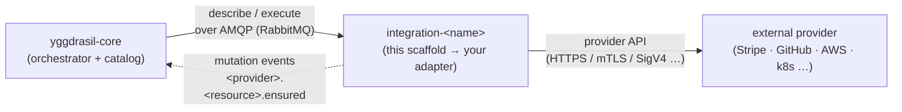

<div align="center">

# `integration-template`

**The canonical scaffold every Yggdrasil integration adapter is cloned from.**

[](LICENSE)
[](go.mod)
[](https://github.com/dakasa-yggdrasil/yggdrasil-core)

Clone · implement a capability · test · publish · adopters install ·
[Getting Started](docs/GETTING-STARTED.md) · [Anatomy](docs/ANATOMY.md) · [Contract](docs/CONTRACT.md) · [Publishing](docs/PUBLISHING.md)

</div>

---

## What it is

A **production-ready scaffold** for a new Yggdrasil integration adapter. Out of
the box it compiles, `go test ./...` passes, the worker boots against a local
RabbitMQ, and `/healthz` / `/readyz` are wired. You clone it, rename the module,
implement the capabilities your provider needs, and ship.

Integrations are the **infra-reconciliation layer** of Yggdrasil — the
self-hosted control plane for declarative workflows + integrations over your
whole stack. Each adapter runs as an independent container, speaks an AMQP RPC
contract with [yggdrasil-core](https://github.com/dakasa-yggdrasil/yggdrasil-core),
and reconciles external resources (`ensure_` / `observe_` / `destroy_`) declared
by a workflow step. `kubernetes`, `aws`, `github`, `grafana`, `stripe`,
`rabbitmq`, and the rest of the catalog all started from this template.

> **This repo is the archetype.** Its docs are written to be exemplary *and* to
> match what the scaffold actually generates. Before changing anything here, read
> [`INTEGRATION_CONTRACT.md`](INTEGRATION_CONTRACT.md) — the law for what an
> integration is and is not.

## Where it fits



The adapter sits **below** workflows and **above** the provider. It reconciles
infrastructure; it never reaches up into business logic. Full layering in
[CONTRACT → where an integration fits](docs/CONTRACT.md#where-an-integration-fits).

## What the scaffold gives you

- A working **AMQP RPC worker** (two queues: `describe`, `execute`) in
  `controllers/message/`.
- The **adapter skeleton** in [`internal/adapter/spec.go`](internal/adapter/spec.go) —
  `Describe()` (the catalog) + `Execute()` (the handlers), with a placeholder
  capability set you replace.
- An HTTP **health server** (`/healthz`, `/readyz`) and graceful shutdown in
  [`main.go`](main.go).
- [`pkg/contractcheck`](pkg/contractcheck/) — a **public** describe-contract
  linter, plus a CI binary (`cmd/lint-action-catalog`) that runs it.
- `Dockerfile` (multi-stage), `Taskfile.yml`, and a local `docker-compose` stack.
- `.github/workflows/` for CI, the ghcr.io **image release**, and the
  **quickstart OCI publish**.
- `yggdrasil-quickstart.yaml` so adopters install your adapter with one command.

## Capabilities (the shipped placeholder)

The scaffold ships a compiling placeholder so the round trip works immediately.
You **replace** these with real, canonically-named capabilities.

| Operation (placeholder) | Resource type | Idempotent |
|---|---|---|
| `generate_installation` | `component` | yes |
| `reconcile_installation` | `component` | yes |
| `discover_installation_state` | `component` | yes |

> These names are **not** the canonical prefixes — they exist only to make the
> scaffold testable. When you implement a real resource, rename to
> `ensure_<resource>` / `observe_<resource_type>` / `destroy_<resource>` /
> `discover_<resource_type>` per the
> [contract](docs/CONTRACT.md#the-four-canonical-prefixes). Real adapters do
> exactly this — e.g. `integration-stripe` exposes `ensure_customer`,
> `observe_customers`, `destroy_webhook_endpoint`.

## Quick start

**Scaffold a new adapter (recommended):**

```sh
yggdrasil new integration my-thing --owner your-org
```

Clones this template, strips its history, rewrites the module path to
`github.com/your-org/integration-my-thing`, and runs `git init`. `go test ./...`
passes in the result.

**Or clone manually:**

```sh
gh repo clone dakasa-yggdrasil/integration-template integration-my-thing
cd integration-my-thing && rm -rf .git && git init
# then rewrite the module path + imports + the "integration-template" string
```

Full walkthrough → [**Getting Started**](docs/GETTING-STARTED.md).

## Configuration

The worker reads its configuration from the environment:

| Env var | Required | Default | Purpose |
|---|---|---|---|
| `BROKER_URL` | **yes** | — (fatal if unset) | RabbitMQ connection string. |
| `HEALTHCHECK_PORT` | no | `8080` | Port for `/healthz` + `/readyz`. |
| `HTTP_READ_HEADER_TIMEOUT_SECONDS` | no | `10s` | Health server read-header timeout. |
| `HTTP_READ_TIMEOUT_SECONDS` | no | `30s` | Health server read timeout. |
| `HTTP_WRITE_TIMEOUT_SECONDS` | no | `30s` | Health server write timeout. |
| `HTTP_IDLE_TIMEOUT_SECONDS` | no | `120s` | Health server idle timeout. |

The placeholder adapter declares an `instance_schema` (no credentials) with
`default_blueprint`, `default_name`, `default_namespace`, `default_data`. Real
credentials, when you add them, are resolved via a `credentials_ref` URI — never
hardcoded. See the [Lego principle](docs/CONTRACT.md#the-lego-principle).

## Operations

| Endpoint | Behavior |
|---|---|
| `GET /healthz` | Liveness — always `200 ok`. |
| `GET /readyz` | Readiness — `200 ready` when the broker connection is open; `503 rabbitmq_unavailable` when closed. |

The worker exits when `BROKER_URL` is unset, on `SIGINT`/`SIGTERM`, or when the
broker connection drops (`conn.NotifyClose`) — letting the kubelet restart the
pod. Errors `Nack` (no requeue) and reply with a structured `{ok:false, error}`
envelope; nothing is swallowed silently. More in
[ANATOMY → operations](docs/ANATOMY.md#operations-where-things-live-at-runtime).

## Development

```sh
task test          # go test ./...
go run ./cmd/lint-action-catalog   # describe-contract lint (CI runs this first)
task config        # validate the compose files
task build:image   # build the adapter image
task up            # local stack: RabbitMQ + adapter
task down          # tear down
task logs          # follow worker logs
```

Repo layout, file by file → [**Anatomy**](docs/ANATOMY.md).

## Publishing

A SemVer tag publishes two artifacts: the multi-arch adapter image to
`ghcr.io/<owner>/<repo>` (`release.yml`) and `yggdrasil-quickstart.yaml` as an OCI
artifact (`publish-oci.yml`). Adopters then run
`yggdrasil install <owner>/<repo>` (or `yggdrasil install oci://…`). Full flow →
[**Publishing**](docs/PUBLISHING.md).

## Docs

| Doc | What's in it |
|---|---|
| [Getting Started](docs/GETTING-STARTED.md) | Scaffold → implement → test → publish → adopter installs. |
| [Anatomy](docs/ANATOMY.md) | Every directory and file, and where to change things. |
| [Contract](docs/CONTRACT.md) | Digest of the law: four prefixes, Lego principle, describe↔execute, self-test checklist. |
| [Publishing](docs/PUBLISHING.md) | Releases, OCI artifacts, and how `yggdrasil install` consumes them. |
| [`INTEGRATION_CONTRACT.md`](INTEGRATION_CONTRACT.md) | **The full, canonical law.** |

## Compatibility

Go 1.25 · `rabbitmq/amqp091-go v1.10.0` · `go.uber.org/zap v1.27.1`. The template
ships its own minimal RPC layer in `controllers/message/` rather than importing
`yggdrasil-sdk-go`, to keep an adopter's import surface small.

## License

Apache 2.0 — see [LICENSE](LICENSE).

---

<div align="center">

Part of [Yggdrasil](https://github.com/dakasa-yggdrasil/yggdrasil-core) ·
The shape every adapter copies.

</div>
