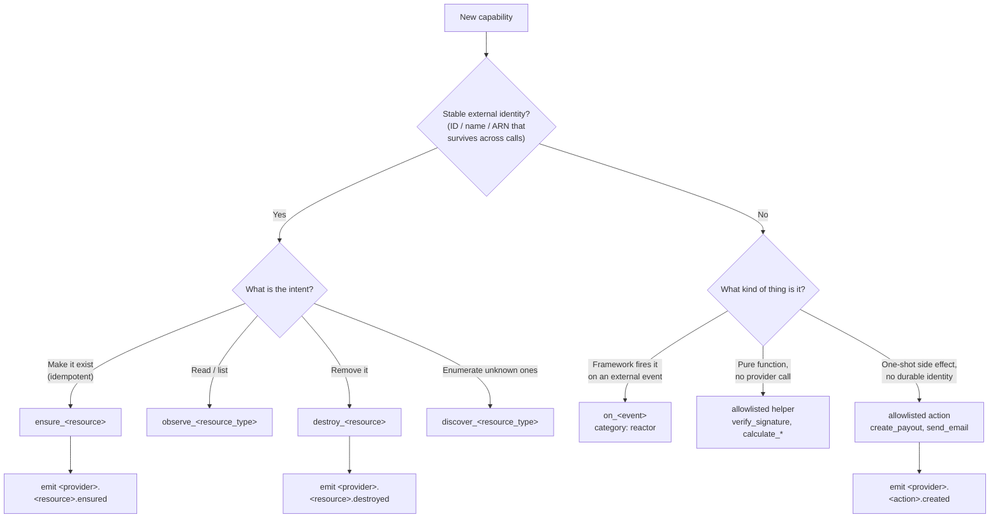
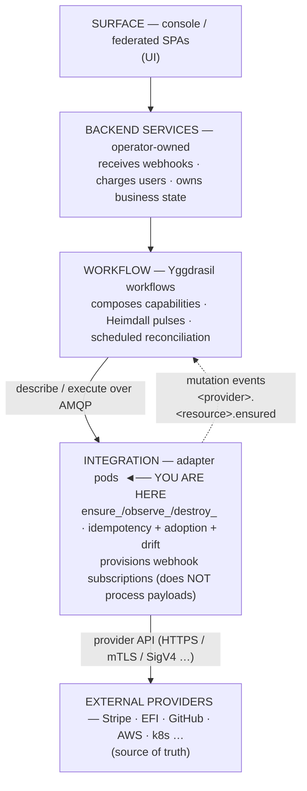

# The integration contract (digest)

> A working summary of what a Yggdrasil integration **is** and **is not**, so you
> can build a conformant adapter without re-reading the whole law every time.

This page is a **digest**. The authority is
[**`INTEGRATION_CONTRACT.md`**](../INTEGRATION_CONTRACT.md) in the repo root —
when this page and the contract disagree, **the contract wins**. yggdrasil-core's
schema validator enforces a subset of the contract at registration time (Phase 1
warn-only, Phase 2 hard-fail).

---

## The one rule to internalize first

**Yggdrasil = the company's own internal infrastructure. Backend = the
end-user's business operations.** Ask: *"if the company is sold or handed to a new
operator, does this resource follow the company or the end-user?"*

- Follows the **company** → Yggdrasil integration owns it
  (e.g. *register* the Stripe webhook URL, *provision* an S3 bucket, *create* the
  team's GitHub repo).
- Follows the **end-user** → backend owns it
  (e.g. *charge* a user, *upload* their avatar, *refund* their order).

Both sides may touch the same provider; they sit on opposite sides of the line.
Full examples in [§0 of the contract](../INTEGRATION_CONTRACT.md#0-absolute-rule--yggdrasil-scope-vs-backend-scope-read-first-no-exceptions).

---

## The Lego principle

Every piece is **generic, agnostic, composable**. An integration MUST NOT assume
which cloud, secret store, broker, orchestrator, database, or observability stack
the operator runs. It reaches those through abstractions:

- credentials via a `credentials_ref` URI (`secret://provider/path`), resolved by
  whichever secrets-management integration the operator chose — never a hardcoded
  `aws_sm_path`;
- events via another integration's capability — never a hardcoded broker dial.

> If you find yourself writing `must be AWS` / `must be Vault` / `must be RabbitMQ`
> anywhere outside the integration's *primary scope*, **stop** and re-read
> [§2](../INTEGRATION_CONTRACT.md#2-the-lego-principle-non-negotiable). The rare
> legitimate coupling (e.g. `integration-aws` manages AWS) requires an ADR.

---

## The four canonical prefixes

Resource operations use exactly these prefixes — never `create_*`, `list_*`,
`get_*`, `update_*`, `delete_*`.

| Prefix | Signature | Semantics |
|---|---|---|
| `ensure_<resource>` | `(desired_state) → observed_state` | Mutating, **idempotent**, **adopts-if-exists**. GET-then-PUT internally. Same input → same output. |
| `observe_<resource_type>` | `(filter?) → ([]observed_state, cursor)` | Read-only, no side effects. Single-resource lookup is `filter={id:"…"}` — there is **no** `get_*`. |
| `destroy_<resource>` | `(ref) → result` | Terminal removal. Provider `404` (already gone) = **success**. Idempotent. |
| `discover_<resource_type>` | `(scope) → []resource` | Service-side enumeration of resources the adapter doesn't yet know about. Optional. |

**Allowlisted exceptions** (no canonical prefix): reactor capabilities
`on_<event>`; pure helpers (`verify_signature`, `calculate_<thing>`,
`dispatch_workflow`, `merge_pull_request`); money-movement actions
(`create_payout`, `create_refund`) — one-shot side effects, not declarative state.

Real example — `integration-stripe` exposes `ensure_customer`,
`observe_customers`, `destroy_webhook_endpoint`, `ensure_webhook_endpoint`,
matching this exactly.

### Naming decision flow



> Tempted to write `create_*` / `list_*` / `delete_*` for a resource? Stop and
> walk this tree — you almost certainly want `ensure_` / `observe_` / `destroy_`.

---

## What an integration IS (invariants)

Resource-oriented · declarative · **idempotent by contract** · **adoption-aware**
· drift-detectable (`observe_*`) · multi-tenant (one type, N instances) ·
**stateless** (no business state of its own) · audit-emitting ·
self-healthchecking (`/healthz` + `/readyz`) · provider-agnostic from above.

## What it is NOT

Not a re-packaged provider SDK · not business logic · not a webhook *business*
processor (it provisions the subscription; it does not process payloads) · not a
storage layer · not a UI/surface · not a workflow · not a runtime · not
cloud-coupled.

If your code reaches into business logic or stores business state, you are
writing a backend service, not an integration.

---

## Mandatory mutation events

Every `ensure_<resource>` and `destroy_<resource>` MUST emit a mutation event
**after** the underlying operation succeeds — this is what makes the change
auditable and reactive.

```
<provider>.<resource>.<verb_past>     e.g. stripe.customer.ensured,
                                            github.repository.ensured,
                                            efi.charge.destroyed
```

`observe_*`, `discover_*`, helpers, and reactors do **not** emit. Money-movement
actions emit with `.created` (e.g. `stripe.refund.created`). With SDK v0.6.0+ the
emission is mechanical — the `reconcile` wrapper emits on success; you only
provide the reconciler. See
[§6.5](../INTEGRATION_CONTRACT.md#65-golden-rule--mandatory-mutation-event-emission-non-negotiable).

---

## Describe and Execute must agree

`Describe()` advertises a catalog; `Execute()` services it. They are two views of
one truth and **must stay aligned**:

- every operation in `SupportedExecuteOperations` appears in the `ActionCatalog`,
  and vice versa;
- every action references a declared `resource_type`;
- every `default_actions` / `idempotent_actions` entry is a real operation.

`pkg/contractcheck` enforces this. CI runs it via
`go run ./cmd/lint-action-catalog` **before** the test suite. If they drift, the
core rejects the adapter at registration (`version_mismatch` /
`action_catalog_mismatch`). **Do not silence the linter.**

> **Response envelope echoes the inbound operation name.** If a caller uses a
> legacy alias that resolves to a canonical handler, the response must echo the
> **inbound** name, not the canonical one — the core's
> `response.Operation != req.Operation` guard rejects mismatches. Centralize the
> echo at the `Execute()` entry point. See
> [§5.b](../INTEGRATION_CONTRACT.md#5b--response-envelope-echoes-inbound-operation-name-non-negotiable).

---

## Smoke tests self-clean

Any smoke that creates a provider-side resource MUST destroy it in the **same**
run, with the destroy step marked `always: true`. Ship the paired `destroy_*` in
the same PR as every new `ensure_*`. Delete (or TTL) ad-hoc smoke workflow
manifests after use. A resource created without cleanup is a leak — a billing
surprise or catalog clutter waiting to happen. See
[§11](../INTEGRATION_CONTRACT.md#11-smoke-tests-must-self-clean-non-negotiable).

---

## Self-test checklist (before opening a PR)

```
[ ] Am I provisioning / reconciling an external resource?      YES → integration
[ ] Does the resource have a stable external identity?         YES → ensure_/observe_/destroy_
[ ] Is my mutation safe to retry (idempotent)?                 YES → continue
[ ] If the resource already exists, do I adopt it gracefully?  YES → continue
[ ] Am I storing any business state in the adapter?            NO  → continue (YES → backend)
[ ] Am I processing inbound webhook payloads as business?      NO  → continue (YES → backend)
[ ] Do my capability names follow the four prefixes (or on_)?  YES → continue
[ ] Did I hardcode AWS / GCP / Vault / RabbitMQ / Postgres?    NO  → continue (YES → STOP, §2)
[ ] Do I log any credential / secret / signing key / token?    NO  → continue (YES → STOP, security)
[ ] Is every breaking change at a major bump + compat shim?    YES → continue
[ ] Do ensure_/destroy_ emit a mutation event on success?      YES → continue
[ ] action_catalog and resource_types[].default_actions align? YES → continue
```

Any `NO` / `YES → STOP` — restructure before opening the PR. Canonical version in
[§10](../INTEGRATION_CONTRACT.md#10-self-test-am-i-writing-an-integration-checklist-before-opening-pr)
and the short form in [`CONVENTIONS.md`](../CONVENTIONS.md).

---

## Where an integration fits



The adapter sits **below** workflows and **above** the provider. It never reaches
up into business logic.

---

## Forbidden anti-patterns (rejected in PR or by validator)

1. CRUD-style names (`create_*`/`list_*`/`get_*`/`delete_*`/`update_*`) for
   resource ops.
2. Receiving an external webhook to process business logic.
3. The integration owning its own database.
4. Non-idempotent mutation without an idempotency key.
5. A capability that does not adopt pre-existing resources.
6. Logging credentials / secrets / signing keys / tokens at any level.
7. Hardcoding a specific cloud / secret store / broker / DB.
8. A reactor (`on_*`) that makes business decisions.
9. Inline credentials in `integration_instance` config (always `credentials_ref`).

---

*Read the full law:* [`INTEGRATION_CONTRACT.md`](../INTEGRATION_CONTRACT.md) ·
*Build one:* [Getting Started](GETTING-STARTED.md) ·
*Find your way around:* [Anatomy](ANATOMY.md) ·
Back to the [README](../README.md) ·
[yggdrasil-core](https://github.com/dakasa-yggdrasil/yggdrasil-core).
