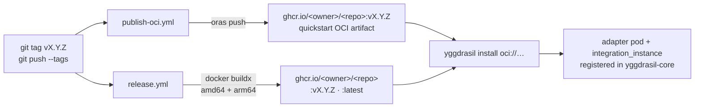
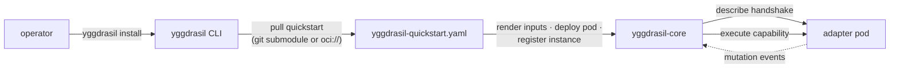

# Publishing

> How a tag turns into a published adapter image and an installable quickstart,
> and how `yggdrasil install` consumes the result.

Two artifacts ship per release, from one SemVer tag:

1. the **adapter container image** → `ghcr.io/<owner>/<repo>` (via `release.yml`);
2. the **quickstart manifest** as an OCI artifact → same registry (via
   `publish-oci.yml`).

---

## The release flow at a glance



---

## `release.yml` — the adapter image

Triggers on `push` to `main`, on `v*` tags, and on manual dispatch. It logs in to
ghcr.io with the workflow `GITHUB_TOKEN`, computes tags, and builds a **multi-arch
(amd64 + arm64)** image with `docker buildx`, pushing to
`ghcr.io/${{ github.repository }}`.

Tag mapping:

| Event | Image tags |
|---|---|
| `v*` tag (`v1.2.3`) | `:v1.2.3` **and** `:latest` |
| push to `main` | `:edge` |
| any | `:sha-<short>` |

Out of the box, your first `vX.Y.Z` tag publishes
`ghcr.io/<owner>/<repo>:vX.Y.Z` with no extra setup beyond the repo having
`packages: write` (the workflow already requests it). The image carries the
`org.opencontainers.image.licenses=Apache-2.0` label.

---

## `publish-oci.yml` — the quickstart artifact

Triggers on `v*.*.*` tags (and manual dispatch with an optional `tag` input). It:

1. **resolves and validates the tag** — rejects anything not matching
   `^[A-Za-z0-9_.-]+$`, so a crafted `workflow_dispatch` input can't inject shell
   metacharacters;
2. installs [ORAS](https://oras.land) and logs in to ghcr.io;
3. pushes `yggdrasil-quickstart.yaml` as an OCI artifact:

```
oras push ghcr.io/<owner>/<repo>:<tag> \
  --artifact-type application/vnd.yggdrasil.integration.v1+yaml \
  yggdrasil-quickstart.yaml:application/vnd.yggdrasil.quickstart.v1+yaml
```

The single layer carries media type
`application/vnd.yggdrasil.quickstart.v1+yaml`. The CLI prefers that layer when
pulling, falling back to the first layer otherwise.

Requirement: the repo must allow `packages: write` (automatic under
`GITHUB_TOKEN`) and the author has the `packages` permission enabled.

---

## Before your first release: fill the quickstart `TODO:`s

`yggdrasil-quickstart.yaml` ships full of placeholders. Replace them before
cutting `v0.1.0`:

| Field | Replace with |
|---|---|
| `metadata.description`, `spec.display_name`, `spec.description` | Real, adopter-facing copy (shown in the install TUI). |
| `providers[].id` / `display_name` / `description` | Your provider's identity. |
| `inputs[].image` default (`ghcr.io/your-org/integration-template:latest`) | **Your published image ref** — this is the one operators most often forget. |
| `steps` → `register-instance` → `type_ref` | The `integration_type` manifest your family repo publishes. |
| `smoke_test` | A real **read-only** capability (e.g. an `observe_*`) that proves the AMQP round trip. |

The quickstart's default steps deploy the adapter via the `kubernetes` integration
(`apply_manifest` for a ServiceAccount + Deployment), inject `BROKER_URL` from a
`yggdrasil-broker` secret, and register the `integration_instance` in the core.
Adapt the steps to your real deployment shape.

> **Single-container Deployment.** The quickstart deploys exactly one container —
> the adapter binary. Do not add a sidecar that shares the adapter's health port
> (`HEALTHCHECK_PORT`, default `8080`); that is a forbidden topology per
> [INTEGRATION_CONTRACT.md §16](../INTEGRATION_CONTRACT.md#16-adapter-deployment-topology--single-container-by-default-non-negotiable).

---

## How `yggdrasil install` consumes it

`yggdrasil install <owner>/<repo>` resolves the adapter from the catalog and
brings it into the operator's deployment. Two delivery paths:

- **Catalog / git path** — the CLI's install manager (`internal/integrations`)
  adds the adapter as a git submodule under `integrations/<repo>` and seeds its
  `.env` from `.env.example`, so the adapter's compose service joins the local
  stack.
- **OCI ref path** — `yggdrasil install oci://ghcr.io/<owner>/<repo>:<tag>` pulls
  the quickstart OCI artifact published by `publish-oci.yml`, selecting the
  `application/vnd.yggdrasil.quickstart.v1+yaml` layer, and renders it.

Either way, the quickstart drives the rest: the CLI walks the operator through
the declared `inputs` (TUI by default; `--non-interactive` for CI), compiles a
workflow that deploys the adapter pod and registers the `integration_instance`
with yggdrasil-core, and runs the `smoke_test` to confirm the round trip.

Once the instance is registered, the core can dispatch your capabilities from
workflow steps over the describe/execute AMQP queues. The loop closes:



---

## Versioning

SemVer is strict. Breaking changes (rename a capability, change an input schema,
remove a resource type) happen **only at a major bump**, with a compat shim
(`WithLegacyNames`) for one minor cycle. The describe handshake validates your
catalog at registration — a drifted `Describe()` is rejected before any traffic
flows. See [CONTRACT → describe and execute](CONTRACT.md#describe-and-execute-must-agree)
and [§8 of the contract](../INTEGRATION_CONTRACT.md#8-lifecycle-invariants-mandatory-at-registration).

---

*See also:* [Getting Started](GETTING-STARTED.md) ·
[Anatomy → workflows](ANATOMY.md#githubworkflows) ·
[CONTRACT](CONTRACT.md) ·
Back to the [README](../README.md) ·
[yggdrasil-core](https://github.com/dakasa-yggdrasil/yggdrasil-core).
